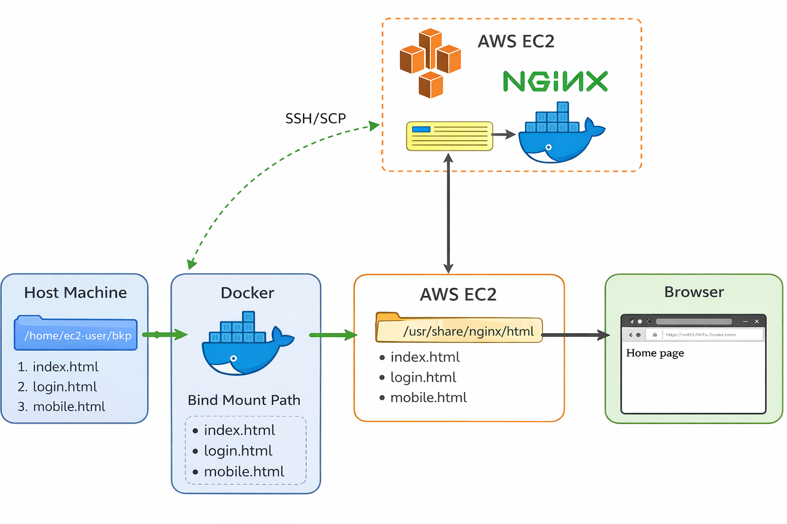

#  Docker Bind Mount with Nginx on AWS EC2


Docker Bind Mount Implementation for Static Website Deployment using Nginx on AWS EC2


---

##  Project Description
This project demonstrates a real-world hands-on implementation of **Docker Bind Mount** by deploying a static website using an **Nginx container** on an **AWS EC2 (Amazon Linux )** instance.

The main goal of this project is to understand how files from the host machine can be directly mounted inside a Docker container and updated in real time without rebuilding the container image.

This project is ideal for **DevOps beginners** who want a clear and practical understanding of Docker storage concepts.

---

##  Technology Stack

| Category | Tools / Services |
|--------|------------------|
| Cloud | AWS EC2 (Amazon Linux 2023) |
| Containerization | Docker |
| Web Server | Nginx |
| OS & Networking | Linux, SSH, SCP |
| Frontend | HTML (Static Website) |

---

##  Learning Outcomes

| Concept | Explanation |
|------|------------|
| SSH & SCP | Connected to EC2 securely and transferred files from local system |
| Docker Containers | Created, managed, removed containers |
| Bind Mount | Mounted host directory directly into container |
| Nginx Hosting | Served static website using Nginx |
| Live Sync | Changes on host reflected instantly in container |
| Browser Access | Website accessed using EC2 Public IP |

---

##  Project Structure (Host Machine)

| Path | Description |
|----|-------------|
| /home/ec2-user/bkp/ | Host directory for website files |
| index.html | Home page |
| login.html | Login page |
| mobile.html | Mobile page |

This directory is bind-mounted into the container.

---

##  Container Structure

| Container Path | Purpose |
|---------------|--------|
| /usr/share/nginx/html | Default Nginx web root |
| Bind Mount | Host files mapped here |

---

##  Step-by-Step Implementation

| Step | Action |
|----|-------|
| 1 | Connected to AWS EC2 using SSH |
| 2 | Created website files inside host directory |
| 3 | Pulled Nginx Docker image |
| 4 | Run Nginx container with Bind Mount |
| 5 | Verified files inside container |
| 6 | Accessed website using browser |

---

##  Docker Command Used
```
docker run -d -p 80:80 --name mynginx -v /home/ec2-user/bkp:/usr/share/nginx/html nginx
```
---

##  Browser Output
The website was successfully accessed using:

http://EC2-PUBLIC-IP

Changes made in the host directory were instantly reflected in the browser without restarting the container.

---

##  Screenshots Guide (Very Important)

Home Page: http://EC2-Public-IP/home.html  


Login Page: http://EC2-Public-IP/login.html


Mobile Page: http://EC2-Public-IP/mobile.html


---

##  Key Concept: Docker Bind Mount

| Feature | Explanation |
|------|------------|
| Direct Mapping | Host directory directly mapped to container |
| Persistence | Data remains even after container removal |
| No Rebuild | No need to rebuild Docker image |
| Best Use | Development and learning |

---

##  Use Cases

| Use Case | Benefit |
|-------|---------|
| DevOps Learning | Strong Docker fundamentals |
| Static Website Hosting | Simple & efficient |
| Development Setup | Real-time file updates |
| Interview Prep | Commonly asked Docker concept |


---

##  Author
**Neha Pawar**


---

##  Sharing Platforms
 GitHub : Iamnehapawar

 Medium : Neha pawar

 LinkedIn : https://www.linkedin.com/in/neha-pawar-3ba4a131b?utm_source=share&utm_campaign=share_via&utm_content=profile&utm_medium=android_app


